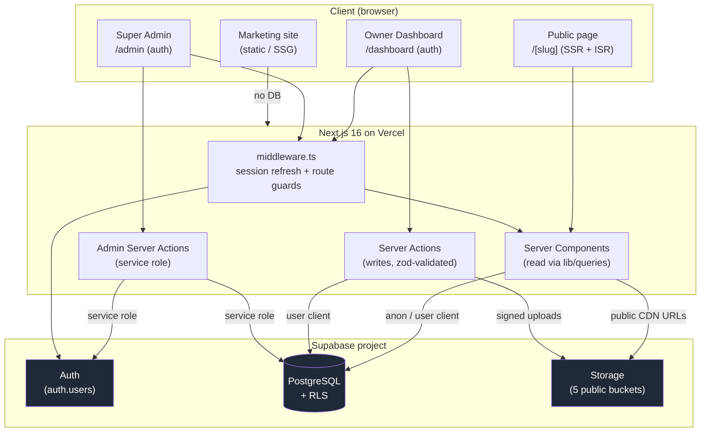
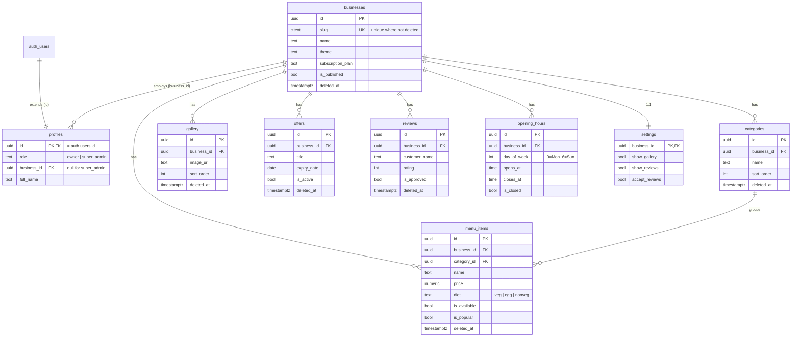
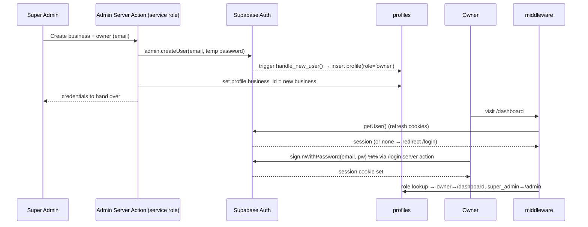

# BACKEND.md — Zerico Multi-Tenant Backend Architecture

> Companion to [PROJECT.md](PROJECT.md). PROJECT.md is the **product** source of
> truth; this file is the **backend** source of truth. Where they overlap, this
> file wins for data/auth/RLS decisions.
>
> **Principle:** one application, one database, **thousands of businesses**.
> Nothing is modelled around a single restaurant. Adding a business is inserting
> a row — never a code change.
>
> **Status:** proposed — awaiting approval before implementation.

---

## 0. Design tenets

1. **Shared schema, row-level tenancy.** Every tenant-owned row carries
   `business_id`. Isolation is enforced by Postgres **Row Level Security**, not
   application code — the database is the last line of defence.
2. **Supabase Auth owns credentials.** We never store or hash passwords
   ourselves. `auth.users` is managed by Supabase; our `profiles` table only
   extends it.
3. **Server-side by default.** Public reads run in Server Components with the
   anon client (RLS-filtered). All writes run through **Server Actions** with
   the authenticated client. The service-role key never leaves the server.
4. **Soft-delete for content.** Owner-facing content is recoverable
   (`deleted_at`), so an accidental delete never destroys data or breaks a live
   page.
5. **Same code for 1 or 10,000 tenants.** The public route `[slug]`, the
   dashboard, and the admin cockpit are all generic over `business_id`.

---

## 1. System Architecture Diagram



**Trust boundaries**
- **anon key** → browser + public RSC reads. Everything it can touch is gated by
  RLS "public read" policies.
- **user JWT** (cookie session) → dashboard reads + Server Action writes. RLS
  scopes it to the caller's `business_id`.
- **service-role key** → server-only, used exclusively by Admin Server Actions
  (create business, create owner user). Bypasses RLS by design; never shipped to
  the client.

---

## 2. Entity Relationship Diagram (ERD)



**Cardinality notes**
- `profiles.business_id` is **nullable** (super-admins belong to no business) and
  modelled `o{` so the schema already supports multiple staff per business later
  without migration pain (see §11, open decision D1).
- `settings` is strict **1:1** — its primary key *is* `business_id`.
- Deleting a business cascades to all children (`on delete cascade`).

---

## 3. Database Schema

Conventions applied to every table: `id uuid primary key default gen_random_uuid()`,
`created_at timestamptz not null default now()`, `updated_at timestamptz not null
default now()` (auto-maintained by trigger), and `business_id uuid not null
references businesses(id) on delete cascade` on tenant tables. Content tables add
`deleted_at timestamptz` (soft-delete).

```sql
-- Extensions & enums --------------------------------------------------------
create extension if not exists "pgcrypto";   -- gen_random_uuid()
create extension if not exists "citext";      -- case-insensitive slug/email

-- We use text + CHECK (not native enums) so values are trivial to extend.
-- role:  'owner' | 'super_admin'
-- diet:  'veg' | 'egg' | 'nonveg'
-- plan:  'starter' | 'business' | 'pro'

-- businesses (tenant root) --------------------------------------------------
create table businesses (
  id                uuid primary key default gen_random_uuid(),
  slug              citext not null,
  name              text   not null,
  tagline           text,
  description       text,
  business_type     text,
  theme             text   not null default 'cafe',
  primary_color     text,
  secondary_color   text,
  logo_url          text,
  cover_image_url   text,
  currency_symbol   text   not null default '₹',
  timezone          text   not null default 'Asia/Kolkata',
  phone             text,
  whatsapp          text,
  email             text,
  address           text,
  google_maps_url   text,
  location_lat      numeric(9,6),
  location_lng      numeric(9,6),
  instagram         text,
  facebook          text,
  website           text,
  subscription_plan text   not null default 'starter'
                    check (subscription_plan in ('starter','business','pro')),
  is_published      boolean not null default false,
  created_at        timestamptz not null default now(),
  updated_at        timestamptz not null default now(),
  deleted_at        timestamptz
);
-- Slug is unique only among live businesses, so a deleted slug can be reused.
create unique index businesses_slug_live_uk
  on businesses (slug) where deleted_at is null;
create index businesses_published_idx
  on businesses (is_published) where deleted_at is null;

-- profiles (extends auth.users) ---------------------------------------------
create table profiles (
  id          uuid primary key references auth.users(id) on delete cascade,
  role        text not null default 'owner' check (role in ('owner','super_admin')),
  business_id uuid references businesses(id) on delete set null,
  full_name   text,
  email       citext,
  avatar_url  text,
  created_at  timestamptz not null default now(),
  updated_at  timestamptz not null default now()
);
create index profiles_business_idx on profiles (business_id);

-- categories ----------------------------------------------------------------
create table categories (
  id          uuid primary key default gen_random_uuid(),
  business_id uuid not null references businesses(id) on delete cascade,
  name        text not null,
  sort_order  integer not null default 0,
  created_at  timestamptz not null default now(),
  updated_at  timestamptz not null default now(),
  deleted_at  timestamptz
);
create index categories_business_idx on categories (business_id, sort_order)
  where deleted_at is null;

-- menu_items ----------------------------------------------------------------
create table menu_items (
  id          uuid primary key default gen_random_uuid(),
  business_id uuid not null references businesses(id) on delete cascade,
  category_id uuid references categories(id) on delete set null,
  name        text not null,
  description text,
  price       numeric(10,2),
  image_url   text,
  diet        text not null default 'veg' check (diet in ('veg','egg','nonveg')),
  is_available boolean not null default true,
  is_popular   boolean not null default false,
  sort_order   integer not null default 0,
  created_at  timestamptz not null default now(),
  updated_at  timestamptz not null default now(),
  deleted_at  timestamptz
);
create index menu_items_business_idx on menu_items (business_id, category_id, sort_order)
  where deleted_at is null;

-- gallery -------------------------------------------------------------------
create table gallery (
  id          uuid primary key default gen_random_uuid(),
  business_id uuid not null references businesses(id) on delete cascade,
  image_url   text not null,
  title       text,
  sort_order  integer not null default 0,
  created_at  timestamptz not null default now(),
  updated_at  timestamptz not null default now(),
  deleted_at  timestamptz
);
create index gallery_business_idx on gallery (business_id, sort_order)
  where deleted_at is null;

-- offers --------------------------------------------------------------------
create table offers (
  id          uuid primary key default gen_random_uuid(),
  business_id uuid not null references businesses(id) on delete cascade,
  title       text not null,
  description text,
  image_url   text,
  starts_at   date,
  expiry_date date,
  is_active   boolean not null default true,
  created_at  timestamptz not null default now(),
  updated_at  timestamptz not null default now(),
  deleted_at  timestamptz
);
create index offers_business_idx on offers (business_id)
  where deleted_at is null;

-- reviews -------------------------------------------------------------------
create table reviews (
  id            uuid primary key default gen_random_uuid(),
  business_id   uuid not null references businesses(id) on delete cascade,
  customer_name text not null,
  rating        smallint not null check (rating between 1 and 5),
  body          text,
  is_approved   boolean not null default false,
  created_at    timestamptz not null default now(),
  updated_at    timestamptz not null default now(),
  deleted_at    timestamptz
);
create index reviews_business_idx on reviews (business_id, is_approved)
  where deleted_at is null;

-- opening_hours (one row per weekday per business) --------------------------
create table opening_hours (
  id          uuid primary key default gen_random_uuid(),
  business_id uuid not null references businesses(id) on delete cascade,
  day_of_week smallint not null check (day_of_week between 0 and 6), -- 0=Mon
  opens_at    time,
  closes_at   time,
  is_closed   boolean not null default false,
  created_at  timestamptz not null default now(),
  updated_at  timestamptz not null default now(),
  unique (business_id, day_of_week)
);

-- settings (1:1 with business) ----------------------------------------------
create table settings (
  business_id     uuid primary key references businesses(id) on delete cascade,
  show_gallery    boolean not null default true,
  show_offers     boolean not null default true,
  show_reviews    boolean not null default true,
  accept_reviews  boolean not null default true,
  whatsapp_enabled boolean not null default true,
  created_at      timestamptz not null default now(),
  updated_at      timestamptz not null default now()
);
```

**`updated_at` trigger** applied to every table:

```sql
create or replace function public.set_updated_at()
returns trigger language plpgsql as $$
begin new.updated_at = now(); return new; end $$;

-- e.g.
create trigger trg_menu_items_updated before update on menu_items
for each row execute function public.set_updated_at();
```

> **Split opening hours (lunch/dinner):** the `unique(business_id, day_of_week)`
> constraint allows one interval per day. To support split shifts later, drop
> the unique constraint and add a `sort_order` — no other change needed.

---

## 4. Storage Strategy

Five **public-read** buckets, one per asset type (as requested):

| Bucket | Holds | Path convention |
|---|---|---|
| `logos` | business logo | `{business_id}/{uuid}.webp` |
| `covers` | hero cover image | `{business_id}/{uuid}.webp` |
| `menu-images` | per-item photos | `{business_id}/{uuid}.webp` |
| `gallery-images` | gallery photos | `{business_id}/{uuid}.webp` |
| `offer-images` | offer banners | `{business_id}/{uuid}.webp` |

**Why this shape**
- **First path segment = `business_id`.** Storage RLS derives the tenant from
  the path, so an owner can only write under their own folder.
- **Public read** = served straight from Supabase's CDN, perfect for the public
  page. No signed URLs needed for display.
- **Writes are owner-scoped** via `storage.objects` policies (see §6).

Uploads happen inside Server Actions: validate file (type/size), convert/resize
if needed, upload to `{bucket}/{business_id}/{uuid}.webp`, then store the public
URL on the row (`logo_url`, `image_url`, …).

---

## 5. Authentication Flow

Email + password via **Supabase Auth**. **No public sign-up** — the super-admin
provisions owner accounts (sales-led onboarding). Passwords are always handled
by Supabase; we never see or store them.



**Profile bootstrap trigger**

```sql
create or replace function public.handle_new_user()
returns trigger language plpgsql security definer set search_path = public as $$
begin
  insert into public.profiles (id, email, role)
  values (new.id, new.email, 'owner');
  return new;
end $$;

create trigger on_auth_user_created
after insert on auth.users
for each row execute function public.handle_new_user();
```

**Session handling** uses `@supabase/ssr` (cookie-based). `src/proxy.ts` — the
Next 16 Proxy convention (formerly `middleware.ts`) — refreshes the session on
every request and guards `/dashboard/*` (owner or super-admin) and `/admin/*`
(super-admin only); unauthenticated hits redirect to `/login`.

---

## 6. RLS Strategy

Two SECURITY DEFINER helpers resolve the caller's tenant **without RLS recursion**
on `profiles`:

```sql
create or replace function public.current_business_id()
returns uuid language sql stable security definer set search_path = public as $$
  select business_id from public.profiles where id = auth.uid();
$$;

create or replace function public.is_super_admin()
returns boolean language sql stable security definer set search_path = public as $$
  select exists (
    select 1 from public.profiles
    where id = auth.uid() and role = 'super_admin'
  );
$$;
```

Every table has RLS **enabled**. Policies fall into three archetypes (permissive
policies are OR-ed):

**A. Public read (anon + authenticated), published + visible only** — content tables:

```sql
alter table menu_items enable row level security;

create policy menu_items_public_read on menu_items
for select to anon, authenticated
using (
  deleted_at is null
  and is_available
  and exists (select 1 from businesses b
              where b.id = menu_items.business_id
                and b.is_published and b.deleted_at is null)
);
```

Analogous public-read policies: `businesses` (`is_published and deleted_at is null`),
`categories`, `gallery`, `offers` (`is_active` + not expired), `reviews`
(`is_approved`), `opening_hours`, `settings` (read-only flags). **No public writes**
anywhere except review submission (below).

**B. Owner full access to own rows** — every tenant table:

```sql
create policy menu_items_owner_all on menu_items
for all to authenticated
using      (business_id = public.current_business_id())
with check (business_id = public.current_business_id());
```

Because this is `for all` (incl. SELECT), owners see everything they own —
including unavailable items and unapproved reviews — in the dashboard.

**C. Super-admin, global:**

```sql
create policy menu_items_admin_all on menu_items
for all to authenticated
using (public.is_super_admin()) with check (public.is_super_admin());
```

**Special cases**
- **businesses**: owner may `select`/`update` `where id = current_business_id()`;
  `insert`/`delete` restricted to `is_super_admin()` (new tenants are created by
  the admin cockpit).
- **profiles**: a user may read/update only their own row (`id = auth.uid()`);
  super-admin sees all. Helper functions are SECURITY DEFINER, so no recursion.
- **reviews (public submit)**: anon may `insert` a *pending* review for a
  published business — never self-approve:
  ```sql
  create policy reviews_public_submit on reviews
  for insert to anon, authenticated
  with check (
    is_approved = false
    and exists (select 1 from businesses b
                where b.id = business_id and b.is_published and b.deleted_at is null)
  );
  ```

**Storage RLS** (per bucket; public read, owner-scoped write):

```sql
create policy logos_public_read on storage.objects
for select to anon, authenticated using (bucket_id = 'logos');

create policy logos_owner_write on storage.objects
for insert to authenticated
with check (
  bucket_id = 'logos'
  and (storage.foldername(name))[1] = public.current_business_id()::text
);
-- + matching update/delete policies; repeat for covers, menu-images,
--   gallery-images, offer-images.
```

---

## 7. Data Flow

**7.1 Marketing website** — `(marketing)` route group. Fully static (SSG), **no
database, no auth**. It is the platform's front door and just links into `/login`
and the live demo. Nothing here scales with tenant count.

**7.2 Customer visits `/cloudcafe`** (public page)
1. `[slug]/page.tsx` (Server Component) calls `getPublishedBusinessBySlug('cloudcafe')`
   using the **anon** Supabase client.
2. RLS returns the business **only if `is_published`**. If null → `notFound()`.
3. Sibling queries load the rest, all RLS-filtered to published + visible rows:
   categories, available menu items, gallery, active offers, approved reviews,
   opening hours, settings.
4. Rendered with **ISR** (`revalidate`) + **on-demand** `revalidatePath('/'+slug)`
   fired by owner Server Actions, so edits appear within seconds.
5. Images load directly from public Storage CDN URLs.

**7.3 Owner logs in and is auto-scoped**
1. `/login` Server Action → `signInWithPassword` → session cookie.
2. `middleware.ts` refreshes the session; `/dashboard/*` requires an authenticated
   owner.
3. Dashboard Server Components read with the **user** client — RLS transparently
   restricts every query to `current_business_id()`. The owner never passes a
   `business_id`; it's derived from their JWT. **Cross-tenant access is impossible
   even if we forget a filter in app code.**
4. Writes go through Server Actions with `with check (business_id = current_business_id())`.

**7.4 Unlimited businesses, zero code change**
- A new tenant = one `insert into businesses` (+ `settings`, default `opening_hours`)
  by the admin cockpit. `[slug]`, the dashboard, and every query are generic over
  `business_id`.
- Public pages are **dynamic + ISR** (not build-time SSG over a fixed list), so a
  business goes live the moment it's published — no rebuild.

---

## 8. API / Server Action Architecture

No hand-rolled REST for CRUD. Reads = Server Components via `lib/queries`; writes =
Server Actions; privileged ops = admin actions with the service role.

**Supabase clients** (`src/lib/supabase/`)
- `server.ts` — RSC/Server-Action client (reads cookies) → anon/user context.
- `client.ts` — browser client (only where a client component truly needs it).
- `middleware.ts` — session-refresh helper used by the root `proxy.ts`.
- `admin.ts` — **service-role** client, `import 'server-only'`, used solely by
  admin actions.

**Reads** (`src/lib/queries/*.ts`) — typed, composable, e.g.
`getPublishedBusinessBySlug`, `getOwnerBusiness`, `getMenu(businessId)`.

**Writes** (`src/app/(dashboard)/dashboard/<module>/actions.ts`) — one file per
module (profile, categories, menu, hours, gallery, offers, reviews, settings).
Each action:
1. `'use server'`,
2. authenticates (`getUser()`), else throw/redirect,
3. validates input with a **zod** schema (`src/lib/validation/*`),
4. performs the write with the user client (RLS enforces tenancy),
5. `revalidatePath` for the affected dashboard + public routes,
6. returns a typed `{ ok, error? }` result.

**Admin actions** (`src/app/(admin)/admin/actions.ts`) — `createBusiness`,
`createOwner` (service role: `auth.admin.createUser` + set `profiles.business_id`),
`togglePublish`. Guarded by `is_super_admin()`.

**Types** — generated from the live schema via
`supabase gen types typescript` into `src/types/database.ts`, imported everywhere
for end-to-end type-safety.

---

## 9. Folder Structure (additions)

```
supabase/
├── config.toml
├── migrations/
│   ├── 0001_init.sql          # extensions, tables, indexes, triggers
│   ├── 0002_rls.sql           # helpers + policies
│   └── 0003_storage.sql       # buckets + storage policies
└── seed.sql                   # cloudcafe + The Cloud Cafe demo data

src/
├── proxy.ts                   # Next 16 Proxy (ex-"middleware"): session refresh + route guards
├── lib/
│   ├── supabase/
│   │   ├── server.ts
│   │   ├── client.ts
│   │   ├── middleware.ts
│   │   └── admin.ts           # server-only, service role
│   ├── queries/               # typed reads (public + owner-scoped)
│   ├── validation/            # zod schemas
│   └── auth/                  # getUser, role guards, redirects
├── types/
│   └── database.ts            # generated from Supabase
└── app/
    ├── (marketing)/           # unchanged (no DB)
    ├── [slug]/                # now reads from Supabase (was mock)
    ├── (auth)/login/
    ├── (dashboard)/dashboard/ # owner modules + actions.ts each
    └── (admin)/admin/         # super-admin cockpit + actions.ts
```

`src/data/mock/*` becomes a **seed source** (migrated into `supabase/seed.sql`),
then retired from the runtime path.

---

## 10. Implementation Roadmap (incremental, after approval)

**P2.1 — Foundation.** Supabase project + CLI, `.env.local`, the four client
factories, `middleware.ts` scaffold, type generation wired into a script.
_Verify:_ app boots, a trivial anon query succeeds.

**P2.2 — Schema.** `0001_init.sql` (tables, indexes, `updated_at` triggers,
`handle_new_user`). _Verify:_ migrations apply clean; types generate.

**P2.3 — RLS.** `0002_rls.sql` (helpers + all policies). _Verify:_ a written
policy test — anon sees only published rows, two owners can't see each other's
data, super-admin sees all.

**P2.4 — Storage.** `0003_storage.sql` (5 buckets + policies). _Verify:_ owner can
upload only under their `business_id/` prefix.

**P2.5 — Seed + wire public page.** Seed cloudcafe + The Cloud Cafe; swap
`[slug]` from mock to `lib/queries` (component props unchanged). _Verify:_ public
pages look identical to today, now DB-backed; publish toggle hides/shows a page.

**P3 — Auth + Owner Dashboard.** Login, middleware guards, then modules one at a
time (profile → categories → menu → hours → gallery → offers → reviews →
settings), each with Server Actions + revalidation + image upload.

**P4 — Super Admin Cockpit.** Create business + owner (service role), publish
toggle, impersonate/configure. Onboarding a café end-to-end becomes real.

**P5 — Later.** `analytics_events` (scans, views, clicks) + owner insights;
membership table if multi-staff/location is needed (D1).

Each phase ends with a browser-verified checkpoint and a stop for your review,
per [[phased-delivery]].

---

## 11. Open Decisions (need your call before P2.2)

- **D1 — One owner per business, or a membership table?** Proposed: keep
  `profiles.business_id` (one owner ↔ one business) for the MVP — it matches
  sales-led onboarding and keeps RLS trivial. A `business_members(business_id,
  user_id, role)` join table (staff, multi-location) is a clean later addition;
  the ERD already leaves room. **Recommend: single-owner now.**
- **D2 — `citext` slug vs lower-cased `text`.** Proposed `citext` so
  `/CloudCafe` == `/cloudcafe`. **Recommend: citext.**
- **D3 — Reviews in MVP?** The schema includes `reviews`, but PROJECT.md deferred
  them. Build the table now (cheap) and wire the UI in P3, or table-only for now?
  **Recommend: create table now, UI later.**
- **D4 — Analytics.** Out of this scope (P5), but confirm you're happy deferring.
```
