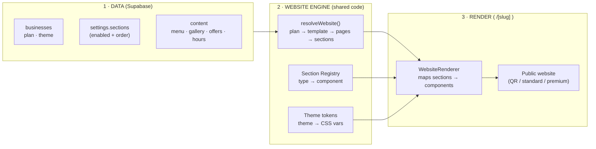
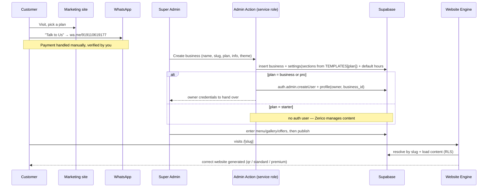

# WEBSITE-ENGINE.md — How Zerico Generates Websites

> Sits **above** [BACKEND.md](BACKEND.md) (data/auth/RLS) and refines
> [PROJECT.md](PROJECT.md). Where routing or component composition is concerned,
> **this file wins**.
>
> **Status:** proposed — awaiting approval before implementation.

---

## 0. The one idea

**Zerico is a Website Generation Platform, not an agency.**

There is exactly **one** React codebase — a *Website Engine* — shared by every
customer. A customer's site is **not** code; it is **data + a plan**. The engine
reads a business row from Supabase, looks at its `plan`, `theme`, and enabled
`sections`, and renders the correct website at request time.

**Hard rules (enforced by the architecture):**
- ❌ No React component ever contains a business's name, menu, colours, or copy.
- ❌ No new file is ever created to onboard a customer.
- ✅ Every visible string/price/image comes from Supabase.
- ✅ Adding a customer = Super Admin inserts rows + picks a plan. The site exists
  the instant it's published.

```
Marketing Website  →  Super Admin  →  Business Database  →  Website Engine  →  Dynamic Public Websites
   (sell)              (enter data)     (Supabase)          (resolve+render)     ( /[slug] )
```

---

## 1. Three layers, one direction



The engine is **pure**: `(business, settings, content) → website`. Same function
for business #1 and business #10,000.

---

## 2. Plan → Experience matrix (the engine's rulebook)

This lives in **code, once** (`website-engine/plans.ts`) and applies to *all*
tenants. It is Zerico's product logic, never per-customer.

| Capability | **Starter ₹299** | **Business ₹599** | **Pro ₹899** |
|---|---|---|---|
| Template | `qr` | `standard` | `premium` |
| Structure | single scroll page | single scroll page | **multi-page** |
| Pages | `home` | `home` | `home · about · menu · gallery · offers · contact` |
| Owner login + dashboard | ❌ | ✅ | ✅ |
| Who edits content | **Zerico (Super Admin)** | Owner | Owner |
| Editable by owner | — | menu · gallery · offers · info | + branding · premium sections |
| Default sections | hero · menu · contact-bar · footer | hero · story · menu · gallery · offers · visit · footer | hero-premium · highlights · story · menu · gallery · offers · testimonials · contact · cta · footer |
| Theme | fixed | theme + colours | theme + colours + premium sections |
| SEO | basic tags | basic tags | full (metadata · OG · sitemap · JSON-LD) |

Only the **plan** decides which of these apply. Change a business's plan from
`business` to `pro` and its website upgrades on the next request — no deploy.

---

## 3. Component architecture — the Section Registry

A website is an **ordered list of Sections**. Each Section is a generic,
reusable React component that knows how to render *a kind of* content, never a
specific business's content.

**Section contract** (every section obeys this — the engine can render any of them the same way):

```ts
// website-engine/types.ts
export type SectionType =
  | 'hero' | 'hero_premium' | 'highlights' | 'story' | 'menu'
  | 'gallery' | 'offers' | 'visit' | 'testimonials' | 'contact'
  | 'cta' | 'contact_bar' | 'footer';

export interface SectionProps {
  business: Business;         // logo, name, colours, contact — from DB
  content: WebsiteContent;    // categories, items, gallery, offers, hours, reviews
  config: SectionConfig;      // per-section options (jsonb): heading override, layout, etc.
}

export type SectionComponent = React.ComponentType<SectionProps>;
```

**The registry** — one map, the engine's only lookup table:

```ts
// website-engine/registry.ts
export const SECTIONS: Record<SectionType, SectionComponent> = {
  hero: Hero,
  hero_premium: HeroPremium,
  highlights: Highlights,
  story: Story,
  menu: MenuSection,
  gallery: GallerySection,
  offers: OffersSection,
  visit: Visit,
  testimonials: Testimonials,
  contact: Contact,
  cta: CtaBand,
  contact_bar: StickyContactBar,
  footer: Footer,
};
```

> Our existing `components/public/*` and `components/cloudcafe/*` are exactly
> these sections — they get **generalised to read from `SectionProps`** instead
> of hardcoded data. No work is thrown away; the beautiful UI becomes the
> section library. Adding a *new kind of section* (e.g. `events`) is the **only**
> reason to write React — and it then works for every business automatically.

**Rendering** is a dumb loop — proof that generation needs no per-customer code:

```tsx
// website-engine/WebsiteRenderer.tsx
export function WebsiteRenderer({ sections, business, content }: RenderArgs) {
  return sections.map(({ type, config }, i) => {
    const Section = SECTIONS[type];
    return <Section key={i} business={business} content={content} config={config} />;
  });
}
```

---

## 4. Templates — plan → pages → sections

A **Template** defines a plan's page structure and the *default* section list per
page. Templates are code (shared), seeded into a business's data on creation so
owners can then toggle/reorder within what their plan allows.

```ts
// website-engine/templates.ts
interface PageDef  { path: string; title: string; sections: SectionType[]; }
interface Template { id: string; multiPage: boolean; pages: PageDef[]; }

export const TEMPLATES: Record<Plan, Template> = {
  starter: { id: 'qr', multiPage: false, pages: [
    { path: 'home', title: 'Menu', sections: ['hero','menu','contact_bar','footer'] },
  ]},
  business: { id: 'standard', multiPage: false, pages: [
    { path: 'home', title: 'Home',
      sections: ['hero','story','menu','gallery','offers','visit','footer'] },
  ]},
  pro: { id: 'premium', multiPage: true, pages: [
    { path: 'home',    title: 'Home',    sections: ['hero_premium','highlights','story','offers','cta','footer'] },
    { path: 'about',   title: 'About',   sections: ['hero','story','testimonials','cta','footer'] },
    { path: 'menu',    title: 'Menu',    sections: ['hero','menu','footer'] },
    { path: 'gallery', title: 'Gallery', sections: ['hero','gallery','footer'] },
    { path: 'offers',  title: 'Offers',  sections: ['hero','offers','cta','footer'] },
    { path: 'contact', title: 'Contact', sections: ['hero','contact','visit','footer'] },
  ]},
};
```

`resolveWebsite(business, settings)` merges the template default with the
business's stored section overrides (enable/disable/reorder) and returns the
final, ordered, enabled sections per page.

---

## 5. Routing — one catch-all for every website

A **single** dynamic route renders every business's every page, for all plans:

```
src/app/(site)/[slug]/[[...page]]/page.tsx     ← the whole public web, generated
```

Request handling:
1. `slug` → `getPublishedBusinessBySlug(slug)` (anon client; RLS gates
   `is_published`). Null → `notFound()`.
2. `pageSlug = params.page?.[0] ?? 'home'`.
3. `website = resolveWebsite(business, settings)` → template + pages.
4. Find the page whose `path === pageSlug`.
   - Not found (e.g. Starter/Business hitting `/about`, or an unknown path) →
     `notFound()`. So plan structure is enforced by routing itself.
5. Load `content` (menu, gallery, offers, hours, reviews — RLS-filtered).
6. `<WebsiteRenderer sections={page.sections} business content />`.
7. `generateMetadata` asks the engine for SEO (full for Pro, basic otherwise).

**Rendering strategy:** dynamic + **ISR** (`revalidate`) with **on-demand**
`revalidatePath('/'+slug, 'layout')` fired by owner/admin writes — a new or
edited business appears in seconds, and we never rebuild to add a tenant.

**Reserved paths** (`/`, `/features`, `/pricing`, `/about`, `/contact`,
`/login`, `/dashboard`, `/admin`) are real routes and always win over `[slug]`.
Slugs are validated against this reserved list at creation time.

---

## 6. Plan-gated dashboard & login (the Starter difference)

Login/dashboard access is **not** a UI toggle — it's a matter of *whether an
owner account exists*:

- **Starter** → the Super Admin creates the **business only**. **No `auth.users`
  row, no owner `profile`.** There is nothing to log into. Content is 100%
  managed from the Super Admin cockpit. If the café wants a menu change, they
  WhatsApp Zerico and the admin edits it.
- **Business / Pro** → the admin creates the business **and** an owner account
  (`auth.admin.createUser` + `profile.role='owner'`, `business_id` set) and hands
  over credentials. `/dashboard` scopes to their business via RLS.

The dashboard codebase is identical for Business and Pro; **which modules render
is driven by the plan** (Pro exposes branding + premium-section controls;
Business exposes menu/gallery/offers/info). Same components, plan-gated by data.

---

## 7. Data model — additions to BACKEND.md §3

The engine needs only small, generic additions (no per-customer columns):

**`businesses`** — already has `subscription_plan` and `theme`. That's the whole
switch. (Template is derived from `plan` in code; no redundant column.)

**`settings.sections jsonb`** — the enabled/ordered sections, per page, seeded
from the plan's template at creation and editable within plan limits:

```jsonc
// settings.sections  (shape documented; validated by zod on write)
{
  "home": [
    { "type": "hero",    "enabled": true },
    { "type": "story",   "enabled": true,  "config": { "heading": "Our Story" } },
    { "type": "menu",    "enabled": true },
    { "type": "gallery", "enabled": false },      // owner turned it off
    { "type": "offers",  "enabled": true },
    { "type": "visit",   "enabled": true },
    { "type": "footer",  "enabled": true }
  ]
  // Pro adds "about","menu","gallery","offers","contact" page keys
}
```

> **Why JSONB, not a `business_sections` table:** sections are always read as one
> ordered document to render a page, never queried individually, and their config
> is heterogeneous. JSONB is the idiomatic, faster fit. (A normalised table is
> the documented alternative if we later need to query across tenants by section.)

**Seeding on creation** — an `initialise_business(plan)` step (Server Action /
SQL function) writes `settings` with `sections` copied from `TEMPLATES[plan]`,
plus default `opening_hours`. Nothing else required for a site to exist.

Everything else (tables, RLS, storage, soft-delete) is unchanged from BACKEND.md.
RLS still guarantees a business only ever sees its own rows; the engine only ever
reads published, visible content for the public site.

---

## 8. Onboarding flow (sales-assisted) — end to end



**No developer step anywhere in this flow.** Step 7 ("system generates the
website") is just the engine reading data — there is no code-generation, no AI,
no new files.

---

## 9. Why this scales to thousands with zero code

- **One route** (`[slug]/[[...page]]`) serves every page of every business.
- **One registry** of sections; a business just references section *types* by
  name in its data.
- **One plan matrix**; upgrading a plan re-generates the experience from the same
  code.
- **Adding a business** touches only rows. **Adding a capability** (new section,
  new theme, new plan tier) is done once in the engine and is instantly available
  to all tenants.

The only reasons to ever write React again: a genuinely new **section type**, a
new **theme**, or a new **plan template** — all shared platform features, never
customer-specific.

---

## 10. Folder structure (engine additions)

```
src/
├── website-engine/
│   ├── plans.ts             # Plan → capabilities matrix (§2)
│   ├── templates.ts         # Plan → pages → default sections (§4)
│   ├── registry.ts          # SectionType → component (§3)
│   ├── resolveWebsite.ts    # (business, settings) → resolved pages/sections
│   ├── WebsiteRenderer.tsx  # ordered section render loop
│   ├── types.ts             # SectionProps, SectionConfig, WebsiteContent
│   ├── seo.ts               # per-plan metadata / JSON-LD
│   ├── sections/            # generic sections (from public/* + cloudcafe/*)
│   └── themes/              # theme → CSS-var token maps
├── app/
│   ├── (marketing)/         # unchanged
│   ├── (site)/[slug]/[[...page]]/page.tsx   # the Website Engine route
│   ├── (auth)/login/
│   ├── (dashboard)/dashboard/   # Business/Pro; plan-gated modules
│   └── (admin)/admin/           # Super Admin cockpit + create-business flow
└── lib/ …                    # supabase clients, queries, validation (BACKEND.md §8)
```

Existing `[slug]` (restaurant demo) and `thecloudcafe` (bespoke) get **migrated
into the engine** as data (Business-plan and Pro/QR examples) and their bespoke
routes retired — proving the engine reproduces both.

---

## 11. Implementation roadmap (revised, still no code yet)

**E1 — Engine core (mock data first).** `types`, `registry`, `plans`,
`templates`, `resolveWebsite`, `WebsiteRenderer`, and the `[slug]/[[...page]]`
route. Generalise existing sections to `SectionProps`. _Verify:_ `/cloudcafe`
(business template) and a Pro example render from **config**, identical to today,
with **zero business-specific code**.

**E2 — Supabase foundation + schema + RLS + storage.** As BACKEND.md P2.1–P2.4,
plus `settings.sections` JSONB and `initialise_business(plan)`.

**E3 — Wire engine to Supabase.** Swap mock for `lib/queries`; seed cloudcafe
(Business) + The Cloud Cafe (Pro or QR). _Verify:_ publish toggle + plan change
re-generates the site live.

**E4 — Super Admin cockpit.** Create business (name, slug, plan, info, theme) →
auto-seed sections; conditionally create owner account (Business/Pro); publish.
_Verify:_ a brand-new café goes live end-to-end with no code.

**E5 — Owner dashboard.** Plan-gated modules (menu, gallery, offers, info; Pro +
branding/sections), Server Actions + revalidation.

**E6 — Pro polish & SEO.** Premium sections, per-plan metadata/sitemap/JSON-LD.

Each phase ends with a browser-verified checkpoint and a stop for review, per
[[phased-delivery]].

---

## 12. Open decisions (need your call before E1)

- **D1 — Owner-editable section toggles in MVP?** The engine supports per-section
  enable/reorder via `settings.sections`. Ship owner controls for it now, or seed
  sensible defaults per plan and expose toggles later? **Recommend: seed
  defaults now, expose toggle UI in E5.**
- **D2 — RESOLVED: The Cloud Cafe = the Pro demo** (multi-page premium showcase).
  A simpler Business-plan example will be added later. The generic `cloudcafe`
  mock stands in as the Business/standard example for now.
- **D3 — Confirms from the prior message still stand:** single-owner-per-business,
  `citext` slugs, reviews table-now/UI-later, analytics deferred. Still good?
- **D4 — Custom domains for Pro** (`thecloudcafe.com`) — later, or in scope for
  Pro now? **Recommend: later; path-based `/[slug]` for all plans in MVP.**
```
